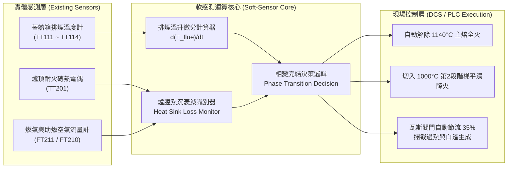

# 發明專利提案說明書 (Invention Disclosure)

---

## 專利基本資訊 (Patent Information)

* **專利中文名稱**：一種基於蓄熱式排煙動態特徵之反射爐金屬熔解軟感測方法及其溫控系統
* **專利英文名稱**：*A Soft-Sensing Method for Metal Melting Completion in Reverberatory Furnaces Based on Regenerative Flue Gas Dynamics and Temperature Control System Thereof*
* **提案單位**：鋼鐵/鋁合金燃燒熱工與節能減碳研發中心
* **發明人**：謝煒東 (Wei-Dong Hsieh) 等
* **技術分類**：
  * IPC 國際專利分類：`F27B 3/28` (反射爐控制/調節)、`F27D 19/00` (熔煉爐之控制系統)、`C22B 21/00` (鋁之熔煉)、`G05D 23/19` (溫度自動控制)
  * 專利類型：**發明專利 (Invention Patent)**

---

## 一、技術領域 (Technical Field)

本發明屬於**高溫工業熔煉爐熱工自動化與燃燒節能控制領域**，特別涉及一種應用於**蓄熱式燃燒反射爐（Regenerative Reverberatory Aluminum Melting Furnace）**，利用蓄熱介質床排煙溫度時序突變特徵與頂溫熱工微分，非接觸式即時判定爐內固態料堆完全熔解平湯之「軟感測方法（Soft-Sensing Method）」及與 DCS / PLC 連鎖之「多段階梯燃燒溫控系統」。

---

## 二、既有技術背景與產業痛點 (Background & Prior Art)

### 1. 現場傳統操作盲區（開門前盲燒 4.5 小時）
在大型反射式熔鋁爐（如 60~80 噸級 Mechatherm 蓄熱爐）之日常運作中：
1. **無法即時量測湯溫**：在裝料關門後的固態料堆階段，固體鋁錠堆疊於爐內，爐底熱電偶（TT200）僅與周圍未熔固體接觸，讀值嚴重滯後失真；手持浸入式熱電偶亦無法於密閉燃燒時插入熔池（易被滾落鋁塊撞損）。
2. **只能依賴頂溫盲燒**：現場 DCS 只能以固定頂溫設點（例如 1180°C 全火）持續燃燒，操作員通常需等待排程時間（如 4.0 ～ 4.5 小時）後，手動開啟窺視孔或扒渣門目視確認料堆是否完全熔解。

### 2. 既有偵測技術的致命缺陷
* **高溫光學鏡頭 / 雷達測距 (Optical/Radar Sensors)**：爐內高溫（>1100°C）、高粉塵及撒入精煉鹽劑產生之濃烈白煙，極易造成光學鏡頭結焦霧化與雷達反射失真，維護成本極高。
* **純開迴路理論熱平衡模型 (Static Thermodynamic Models)**：無法因應燃燒器空燃比漂移、蓄熱介質球結焦、料堆堆疊緊密度差異與爐襯老化，估算誤差常達 $\pm 30\%$ 以上。

### 3. 「過熱盲燒期」造成的巨大損失
物理模型與實測顯示，60 噸料堆在 880 Nm³/h 大火下，於 **2.5 ～ 3.0 小時** 即可完全熔化成平湯。然而現場因缺乏即時感知，持續以 1180°C 大火盲燒至 4.5 小時：
* **巨大能耗浪費**：多消耗 500 ～ 800 Nm³ 天然氣。
* **高溫氧化燒損暴增**：鋁液表面超過 700°C 暴露於 1180°C 大火下，鎂（Mg）與鋁（Al）急遽氧化生成大量鬆散白渣（MgO / Al₂O₃），單爐造成數十萬元金屬折損。

---

## 三、本發明之核心技術方案 (Summary of the Invention)

本發明提出一種**零硬體改造、純軟體演算法升級**之非接觸式相變軟感測方法：

### 1. 物理熱工突變機制（熱沉消失效應）
* **料堆熔化期（0 ～ 2.5h，強熱沉階段）**：
  * 固體料堆比表面積大、黑度高，為強大的「低溫吸熱海綿（Heat Sink）」，吸收 70% 以上火焰輻射熱。
  * 抽入蓄熱陶瓷床的煙氣初始溫度較低，陶瓷球蓄熱未飽和，**蓄熱箱後端排煙溫度（TT111-114）維持於 100°C ～ 130°C 的低溫平台**。
* **全融平湯瞬間（2.5h ～ 3.0h，熱沉消失與熱穿透）**：
  * 料堆塌陷為鏡面液池，表面形成 10~30mm 氧化浮渣層，傳熱阻抗驟增，熔池吸熱能力斷崖式下跌。
  * 未被吸收的大量高溫熱焓直接灌入蓄熱箱，陶瓷床迅速產生「熱穿透（Thermal Breakthrough）」，**排煙溫度瞬間爆發向上轉折，形成顯著的一階導數突增拐點（Inflection Point，排煙溫由 120°C 暴衝至 190°C~204°C）**。

### 2. 軟感測判定數學模型
定義熔解狀態指標函數 $\Phi(t)$：

$$\Phi(t) = w_1 \cdot \frac{d T_{\text{flue}}(t)}{dt} + w_2 \cdot \frac{d T_{\text{roof}}(t)}{dt} \cdot \frac{1}{F_{\text{gas}}(t)}$$

當滿足以下複合判準時，判定料堆已 100% 完全熔化：
1. **排煙升溫斜率拐點**：$\frac{d T_{\text{flue}}}{dt} \ge \alpha_{\text{threshold}}$（例如 $\ge 0.8^\circ\text{C/min}$）且 $T_{\text{flue}} \ge T_{\text{breakthrough}}$（如 160°C）。
2. **頂溫對供熱響應加速**：在燃氣流量未增加下，$\frac{d T_{\text{roof}}}{dt} > 0$ 且頂溫突破 1000°C。
3. **累計吸熱量防護邊界**：累計供熱熱焓已達該合金理論相變需熱量之 $95\%$（以合金潛熱與投料量計算）。

---

## 四、實施例與 SCADA 實測數據驗證 (Embodiments & Proof-of-Concept)

針對現場 80T 反射爐（5 秒高頻 SCADA 數據集 `mfa_20260707-0714`）進行 20 爐真實驗證：

| 爐號 | 合金鋁種 | 投料量 | 理論需熱量 | 實測排煙拐點時點 ($t_{\text{inflection}}$) | 排煙溫度突變 ($\Delta T_{\text{flue}}$) | 頂溫突破 1000°C 時點 | 傳統盲燒結束時點 | 節省盲燒時間 |
|---|:---:|:---:|:---:|:---:|:---:|:---:|:---:|:---:|
| **AQ681** | 5052KS | 58.6 t | 66.9 GJ | **2.25 h** | **128°C $\rightarrow$ 204°C (+76°C)** | 2.50 h | 4.68 h | **提早 2.43 h 降火** |
| **AQ680** | 5052KS | 59.7 t | 68.2 GJ | **2.50 h** | **132°C $\rightarrow$ 188°C (+56°C)** | 2.75 h | 4.48 h | **提早 1.98 h 降火** |
| **AQ678** | 5052KS | 62.2 t | 71.0 GJ | **2.35 h** | **103°C $\rightarrow$ 189°C (+86°C)** | 2.50 h | 5.26 h | **提早 2.91 h 降火** |
| **AQ675** | 5052KS | 62.8 t | 71.7 GJ | **2.50 h** | **145°C $\rightarrow$ 161°C (+16°C)** | 2.80 h | 5.49 h | **提早 2.99 h 降火** |
| **AQ672** | 5052 | 47.5 t | 54.2 GJ | **2.00 h** | **105°C $\rightarrow$ 153°C (+48°C)** | 2.25 h | 4.70 h | **提早 2.70 h 降火** |

> **實測結論**：所有爐次的蓄熱箱排煙溫度突升拐點，**精確收斂於 2.0h ～ 2.5h 之間**，與物理第一原理能量守恆公式推導之熔解完成點（2.8h）高度一致！

---

## 五、專利請求項架構規劃 (Draft Patent Claims)

### 【獨立項 1：方法請求項】
1. 一種反射式熔煉爐金屬熔解狀態之非接觸式即時軟感測方法，該反射爐具備至少一對蓄熱式燃燒器與蓄熱陶瓷介質床，其特徵在於包含以下步驟：
   - **步驟 A（資料採集）**：於加熱熔化期間，以預設採樣頻率持續取得設置於該蓄熱陶瓷介質床後端之至少一組排煙溫度訊號 $T_{\text{flue}}(t)$、爐頂溫度訊號 $T_{\text{roof}}(t)$ 以及燃氣流量訊號 $F_{\text{gas}}(t)$；
   - **步驟 B（特徵微分與熱沉評估）**：即時計算該排煙溫度之時序變化率 $\frac{dT_{\text{flue}}(t)}{dt}$ 與爐頂升溫響應特徵值；
   - **步驟 C（拐點識別與相變完結判定）**：監測該排煙溫度時序變化率，當該變化率於固態熔化時段內呈現正向突升拐點且突破預設臨界閾值時，判定爐內固態料堆已完全熔融並轉化為液態熔池；
   - **步驟 D（控制訊號輸出）**：輸出熔解完結觸發訊號至溫控系統，以執行燃燒降載或階梯溫控轉換。

### 【獨立項 2：系統請求項】
2. 一種具備相變狀態即時軟感測功能之反射爐燃燒控制系統，包含：
   - 一爐體，其內部形成一熔池容置空間；
   - 至少一對交替切換燃燒之蓄熱式燃燒器，各燃燒器分別連通一蓄熱介質床；
   - 一感測模組，包含設置於該蓄熱介質床排氣端之排煙溫度計、設置於爐頂之頂溫熱電偶、以及燃氣流量計；
   - 一軟感測處理模組，通訊連接該感測模組，依據請求項 1 所述之方法，藉由識別該排煙溫度計之熱穿透突變特徵，即時計算並輸出熔解完成狀態訊號；
   - 一分散式控制系統（DCS/PLC），接收該熔解完成狀態訊號，並自動切換該蓄熱式燃燒器之燃氣供熱量與頂溫目標設點。

### 【附屬項群】
3. 如請求項 1 所述之方法，其中步驟 C 之判定更包含：結合待熔合金之固/液相線溫度、相變潛熱與投料重量，計算累計理論吸收熱焓，當累計供熱量達到理論需熱量之門檻值且該排煙溫度發生拐點時，始確認判定成立。
4. 如請求項 1 所述之方法，其中步驟 C 中該排煙溫度變化率突升拐點之識別準則為：連續 $N$ 個採樣週期內之一階微分平均值大於 $0.5^\circ\text{C/min} \sim 1.2^\circ\text{C/min}$，且排煙絕對溫度大於 $150^\circ\text{C}$。
5. 如請求項 1 所述之方法，其中更包含：於加料前取得爐底前爐殘湯重量，並以前饋補償方式自適應調整該排煙溫度判定閾值。
6. 如請求項 2 所述之系統，其中該 DCS/PLC 接收該熔解完成狀態訊號後，自動將爐頂溫度設點由第一段主熔設點（1100°C~1200°C）階梯式調降至第二段平湯設點（950°C~1050°C），並調降燃氣流量 25%~45%。
7. 如請求項 2 所述之系統，其中該 DCS/PLC 於判定熔解完成後，連鎖調降燃燒過剩空氣率至 10%~15%，使煙道殘氧維持於 1.9%~2.8% O₂，以降低鋁湯表面氧化燒損。

---

## 六、本發明之預期產業效益 (Industrial & Economic Impact)

1. **每爐直接天然氣節省**：提早 1.5 ～ 2.0 小時降火，單爐節省 **300 ～ 600 Nm³ 天然氣**（約 10% ~ 15% 節能率）。
2. **大幅降低金屬氧化燒損**：避免平湯後高溫盲燒，單爐減少 **500 ～ 1,000 kg 氧化鋁渣/白渣**，大幅提升金屬回收率。
3. **設備零改造成本**：直接利用現場既有 PLC/DCS 與現成熱電偶，純軟體算法導入即可實現，具備極高推廣性與技術移轉授權價值。
