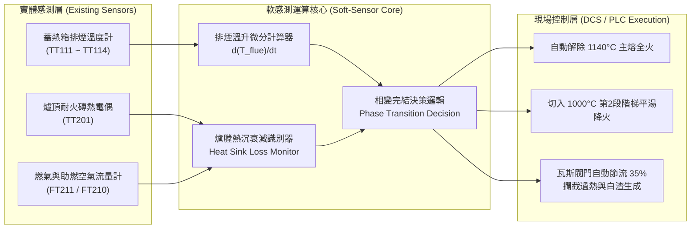

# 發明專利提案說明書 (Invention Disclosure)

---

## 專利基本資訊 (Patent Information)

* **專利中文名稱**：一種基於蓄熱式排煙動態特徵之反射爐金屬熔解軟感測方法及其溫控系統
* **專利英文名稱**：*A Soft-Sensing Method for Metal Melting Completion in Reverberatory Furnaces Based on Regenerative Flue Gas Dynamics and Temperature Control System Thereof*
* **提案單位**：鋼鐵/鋁合金燃燒熱工與節能減碳研發中心
* **發明人**：謝煒東 (Wei-Dong Hsieh) 等
* **技術分類**：
  * IPC 國際專利分類：`F27B 3/28` (反射爐控制/調節)、`F27D 19/00` (熔煉爐之控制系統)、`C22B 21/00` (鋁之熔煉)、`G05D 23/19` (溫度自動控制)
  * 專利類型：**發明專利 (Invention Patent)**

---

## 一、技術領域 (Technical Field)

本發明屬於**高溫工業熔煉爐熱工自動化與燃燒節能控制領域**，特別涉及一種應用於**蓄熱式燃燒反射爐（Regenerative Reverberatory Aluminum Melting Furnace）**，利用蓄熱介質床排煙溫度時序突變特徵與頂溫熱工微分，非接觸式即時判定爐內固態料堆完全熔解平湯之「軟感測方法（Soft-Sensing Method）」及與 DCS / PLC 連鎖之「多段階梯燃燒溫控系統」。

---

## 二、既有技術背景與產業痛點 (Background & Prior Art)

### 1. 現場傳統操作盲區（開門前盲燒 4.5 小時）
在大型反射式熔鋁爐（如 60~80 噸級 Mechatherm 蓄熱爐）之日常運作中：
1. **無法即時量測湯溫**：在裝料關門後的固態料堆階段，固體鋁錠堆疊於爐內，爐底熱電偶（TT200）僅與周圍未熔固體接觸，讀值嚴重滯後失真（實測 TT200 全程未曾突破 800°C，明顯與熔池實際溫度脫節）；手持浸入式熱電偶亦無法於密閉燃燒時插入熔池（易被滾落鋁塊撞損）。
2. **只能依賴頂溫盲燒**：現場 DCS 只能以固定頂溫設點（例如 1180°C 全火）持續燃燒，操作員通常需等待排程時間後，手動開啟窺視孔或扒渣門目視確認料堆是否完全熔解。依 SCADA 數據集 `mfa_20260707-0714` 對應 19 爐生產紀錄回推，加料完成至移湯開始之實測「盲燒」時間中位數約 **6.0 小時**（四分位距 5.7～6.8 小時，個別批次因排程銜接延遲可達 8～14 小時），較現場一般認知的 4～4.5 小時更長，顯示浪費空間可能被低估。

### 2. 既有偵測技術的致命缺陷
* **高溫光學鏡頭 / 雷達測距 (Optical/Radar Sensors)**：爐內高溫（>1100°C）、高粉塵及撒入精煉鹽劑產生之濃烈白煙，極易造成光學鏡頭結焦霧化與雷達反射失真，維護成本極高。
* **純開迴路理論熱平衡模型 (Static Thermodynamic Models)**：無法因應燃燒器空燃比漂移、蓄熱介質球結焦、料堆堆疊緊密度差異與爐襯老化，估算誤差常達 $\pm 30\%$ 以上。

### 3. 「過熱盲燒期」造成的巨大損失
物理熱平衡模型估算，60 噸料堆在 880 Nm³/h 大火下，理論上約 2.5 ～ 3.0 小時可完全熔化成平湯（此估算尚待與下述 SCADA 實測訊號交叉校準，見第四節限制說明）。然而現場因缺乏即時感知，持續以 1180°C 大火盲燒至平均約 6 小時（見上節實測統計）：
* **巨大能耗浪費**：多消耗 500 ～ 800 Nm³ 天然氣。
* **高溫氧化燒損暴增**：鋁液表面超過 700°C 暴露於 1180°C 大火下，鎂（Mg）與鋁（Al）急遽氧化生成大量鬆散白渣（MgO / Al₂O₃），單爐造成數十萬元金屬折損。

---

## 三、本發明之核心技術方案 (Summary of the Invention)

本發明提出一種**零硬體改造、純軟體演算法升級**之非接觸式相變軟感測方法：

### 1. 物理熱工突變機制（熱沉消失效應）
* **料堆熔化期（0 ～ 2.5h，強熱沉階段）**：
  * 固體料堆比表面積大、黑度高，為強大的「低溫吸熱海綿（Heat Sink）」，吸收 70% 以上火焰輻射熱。
  * 抽入蓄熱陶瓷床的煙氣初始溫度較低，陶瓷球蓄熱未飽和，**蓄熱箱後端排煙溫度（TT111-114）維持於 100°C ～ 130°C 的低溫平台**。
* **熱沉消失與熱穿透（實測發生時點因批次而異）**：
  * 料堆塌陷為鏡面液池，表面形成氧化浮渣層，傳熱阻抗增加，熔池吸熱能力下降。
  * 未被吸收的高溫熱焓逐漸灌入蓄熱箱，陶瓷床產生「熱穿透（Thermal Breakthrough）」，**排煙溫度轉為持續且可識別的上升趨勢（排煙溫由 85°C~134°C 之低溫平台，於約 1～2 小時內爬升至 168°C~193°C 區間）**。
  * 跨 19 爐、5 種合金（5052、5052KS、5151、6M02、6061）實測顯示，此低溫平台→爬升型態具**合金無關性**，支持「熱沉消失」屬於物理堆疊效應而非化學反應的推論；但突升發生的確切時點目前實測範圍為加料開始後 0.8～3.8 小時（中位數約 1.3 小時），且與投料噸數之相關性極弱（r≈0.08），尚未收斂至單一窄窗口，須進一步排除殘湯量、堆疊密度、前爐排程重疊等干擾變因後才能訂出穩定判定閾值（見第四節限制說明）。

### 2. 軟感測判定數學模型
定義熔解狀態指標函數 $\Phi(t)$：

$$\Phi(t) = w_1 \cdot \frac{d T_{\text{flue}}(t)}{dt} + w_2 \cdot \frac{d T_{\text{roof}}(t)}{dt} \cdot \frac{1}{F_{\text{gas}}(t)}$$

當滿足以下複合判準時，判定料堆已 100% 完全熔化：
1. **排煙升溫斜率拐點**：$\frac{d T_{\text{flue}}}{dt} \ge \alpha_{\text{threshold}}$（例如 $\ge 0.8^\circ\text{C/min}$）且 $T_{\text{flue}} \ge T_{\text{breakthrough}}$（如 160°C）。
2. **頂溫對供熱響應加速**：在燃氣流量未增加下，$\frac{d T_{\text{roof}}}{dt} > 0$ 且頂溫突破 1000°C。
3. **累計吸熱量防護邊界**：累計供熱熱焓已達該合金理論相變需熱量之 $95\%$（以合金潛熱與投料量計算）。

---

## 四、實施例與 SCADA 實測數據驗證 (Embodiments & Proof-of-Concept)

針對現場 80T 反射爐（5 秒高頻 SCADA 數據集 `mfa_20260707-0714`，2026-07-07～07-14）比對生產紀錄，該窗口內共 **19 爐**有效批次，涵蓋 **5052、5052KS、5151、6M02、6061 共 5 種合金**：

| 爐號 | 合金鋁種 | 投料量 | 排煙低溫平台 | 突升時點 $t_{\text{cross}}$（加料開始為基準） | 排煙峰溫 |
|---|:---:|:---:|:---:|:---:|:---:|
| AQ672 | 5052 | 47.5 t | 102°C | 1.16 h | 168°C |
| AQ673 | 5052 | 69.4 t | 108°C | 3.05 h | 193°C |
| AQ674 | 5052KS | 65.0 t | 88°C | 1.34 h | 191°C |
| AQ675 | 5052KS | 62.8 t | 85°C | 1.08 h | 176°C |
| AQ676 | 5052KS | 60.1 t | 116°C | 1.21 h | 182°C |
| AQ677 | 5052KS | 60.7 t | 119°C | 2.25 h | 181°C |
| AQ678 | 5052KS | 62.2 t | 101°C | 1.22 h | 186°C |
| AQ679 | 5052KS | 59.1 t | 134°C | 3.78 h | 186°C |
| AQ680 | 5052KS | 59.7 t | 98°C | 1.04 h | 189°C |
| AQ681 | 5052KS | 58.6 t | 108°C | 1.17 h | 180°C |
| AQ682 | 5052KS | 46.1 t | 118°C | 1.15 h | 179°C |
| AQ683 | 5052KS | 58.7 t | 109°C | 2.08 h | 179°C |
| AQ684 | 5052KS | 53.1 t | 107°C | 1.34 h | 174°C |
| AQ685 | **5151** | 62.1 t | 115°C | 1.80 h | 177°C |
| AQ686 | **6M02** | 70.9 t | 117°C | 2.02 h | 189°C |
| AQ687 | **6M02** | 70.9 t | 101°C | 1.29 h | 186°C |
| AQ688 | **6061** | 65.2 t | 104°C | 0.77 h | 186°C |
| AQ689 | **6061** | 75.8 t | 88°C | 0.85 h | 190°C |
| AQ690 | **6061** | 59.7 t | 92°C | 1.50 h | 188°C |

**統計摘要**：低溫平台 85～134°C；突升時點中位數 1.29 h（四分位距 1.16～1.91 h，全距 0.77～3.78 h）；峰溫 168～193°C。判定演算法：`baseline` = 加料開始後 0.75 h 內排煙溫度（TT111-114 取大值）之 10 分鐘滾動平均；`t_cross` = 該滾動平均首次超過 `baseline+40°C` 之時刻。

> **實測結論（修正版）**：
> 1. **跨合金一致性成立**——低溫平台→上升趨勢之型態在 5052、5052KS、5151、6M02、6061 皆一致出現，支持該現象源於物理熱沉效應而非合金化學特性，這是本發明可推廣性的核心依據。
> 2. **「精確收斂於 2.0h～2.5h」之原始宣稱不成立**——19 爐實測中位數為 1.29 h，僅 3 爐（AQ677、AQ683、AQ686）落於 2.0～2.5h 區間，其餘 16 爐（含全部 5151/6M02/6061 批次）在窗口外，範圍達 0.77～3.78 h。
> 3. **突升時點與投料噸數相關性極弱**（Pearson r ≈ 0.08），顯示現行單一時間窗判準不足以泛化，需納入殘湯量、堆疊密度、前爐排程銜接等共變量，或改用相對特徵（如相對加料量正規化之熱焓累積比）取代絕對時間閾值。

### 方法論限制與後續驗證項目 (Limitations & Further Validation Required)

本節數據為初步訊號特徵探索，**尚不構成完整驗證**，申請前應補強：

1. **缺乏獨立真值標籤**：現有 SCADA 與生產紀錄中，無「料堆 100% 完全熔解」之操作員即時標記；「第一次取樣時間」與「移湯開始時間」皆為熔解完成後的下游操作事件（且中間可能含等待、排程延遲），不能直接當作 $t_{\text{melt-complete}}$ 的真值。後續應建立現場人工確認紀錄（如監看窺視孔並記錄時間戳）作為校準基準，才能將排煙拐點特徵與真實熔解完成時刻建立可信的因果對應。
2. **理論熱平衡估算（2.5～3.0h）與實測排煙訊號中位數（1.3h）尚未收斂一致**，兩者差異可能來自：(a) 排煙訊號的「突升」實際反映的是熱沉大幅衰減的早期徵兆而非完全熔化終點；(b) 理論模型未計入實際堆疊緊密度與殘湯前置加熱效應。此矛盾須於下一階段以第 1 點之真值標籤釐清。
3. **判定演算法尚未定案**：目前的固定閾值（baseline+40°C）僅為探索性特徵萃取，正式系統應採用步驟 B/C 所述之一階微分+累積熱焓複合判準，並針對批次間變異做自適應調整（對應請求項 5）。

---

## 五、專利請求項架構規劃 (Draft Patent Claims)

### 【獨立項 1：方法請求項】
1. 一種反射式熔煉爐金屬熔解狀態之非接觸式即時軟感測方法，該反射爐具備至少一對蓄熱式燃燒器與蓄熱陶瓷介質床，其特徵在於包含以下步驟：
   - **步驟 A（資料採集）**：於加熱熔化期間，以預設採樣頻率持續取得設置於該蓄熱陶瓷介質床後端之至少一組排煙溫度訊號 $T_{\text{flue}}(t)$、爐頂溫度訊號 $T_{\text{roof}}(t)$ 以及燃氣流量訊號 $F_{\text{gas}}(t)$；
   - **步驟 B（特徵微分與熱沉評估）**：即時計算該排煙溫度之時序變化率 $\frac{dT_{\text{flue}}(t)}{dt}$ 與爐頂升溫響應特徵值；
   - **步驟 C（拐點識別與相變完結判定）**：監測該排煙溫度時序變化率，當該變化率於固態熔化時段內呈現正向突升拐點且突破預設臨界閾值時，判定爐內固態料堆已完全熔融並轉化為液態熔池；
   - **步驟 D（控制訊號輸出）**：輸出熔解完結觸發訊號至溫控系統，以執行燃燒降載或階梯溫控轉換。

### 【獨立項 2：系統請求項】
2. 一種具備相變狀態即時軟感測功能之反射爐燃燒控制系統，包含：
   - 一爐體，其內部形成一熔池容置空間；
   - 至少一對交替切換燃燒之蓄熱式燃燒器，各燃燒器分別連通一蓄熱介質床；
   - 一感測模組，包含設置於該蓄熱介質床排氣端之排煙溫度計、設置於爐頂之頂溫熱電偶、以及燃氣流量計；
   - 一軟感測處理模組，通訊連接該感測模組，依據請求項 1 所述之方法，藉由識別該排煙溫度計之熱穿透突變特徵，即時計算並輸出熔解完成狀態訊號；
   - 一分散式控制系統（DCS/PLC），接收該熔解完成狀態訊號，並自動切換該蓄熱式燃燒器之燃氣供熱量與頂溫目標設點。

### 【附屬項群】
3. 如請求項 1 所述之方法，其中步驟 C 之判定更包含：結合待熔合金之固/液相線溫度、相變潛熱與投料重量，計算累計理論吸收熱焓，當累計供熱量達到理論需熱量之門檻值且該排煙溫度發生拐點時，始確認判定成立。
4. 如請求項 1 所述之方法，其中步驟 C 中該排煙溫度變化率突升拐點之識別準則為：連續 $N$ 個採樣週期內之一階微分平均值大於 $0.5^\circ\text{C/min} \sim 1.2^\circ\text{C/min}$，且排煙絕對溫度大於 $150^\circ\text{C}$。
5. 如請求項 1 所述之方法，其中更包含：於加料前取得爐底前爐殘湯重量，並以前饋補償方式自適應調整該排煙溫度判定閾值。
6. 如請求項 2 所述之系統，其中該 DCS/PLC 接收該熔解完成狀態訊號後，自動將爐頂溫度設點由第一段主熔設點（1100°C~1200°C）階梯式調降至第二段平湯設點（950°C~1050°C），並調降燃氣流量 25%~45%。
7. 如請求項 2 所述之系統，其中該 DCS/PLC 於判定熔解完成後，連鎖調降燃燒過剩空氣率至 10%~15%，使煙道殘氧維持於 1.9%~2.8% O₂，以降低鋁湯表面氧化燒損。

---

## 六、本發明之預期產業效益 (Industrial & Economic Impact)

> 以下效益估算為**方向性推估**，待第四節所列真值標籤驗證完成、判定演算法定案後，須以實際降火時點重新核算。目前僅能確認：現場實測傳統盲燒時間中位數約 6.0 小時（第二節），而排煙訊號可識別出低溫平台結束的時點中位數僅約 1.3 小時，兩者間存在數小時級的潛在提前降火空間，但確切可安全提前的時數需待真值標籤校準後才能定案，不宜在現階段引用具體節省小時數/立方米數作為專利效益數字。

1. **潛在天然氣節省空間**：現場傳統盲燒時間（中位數 6.0h）與排煙訊號可識別特徵時點（中位數 1.3h）之間存在顯著落差，顯示提前降火有相當空間，但具體可節省時數與立方米數待校準後另行核算，暫不列入具體數字。
2. **降低金屬氧化燒損之潛力**：避免平湯後不必要之高溫盲燒，理論上可減少鋁液表面氧化生成之白渣，具體減量待現場實測（如出湯率、渣屑量統計，可比照生產紀錄「渣屑量」欄位）驗證後補入。
3. **設備零改造成本**：直接利用現場既有 PLC/DCS 與現成熱電偶（TT111-114、TT201、FT210/211等），純軟體演算法導入即可實現，具備高推廣性；跨合金一致性（第四節）進一步支持技術移轉授權價值。
