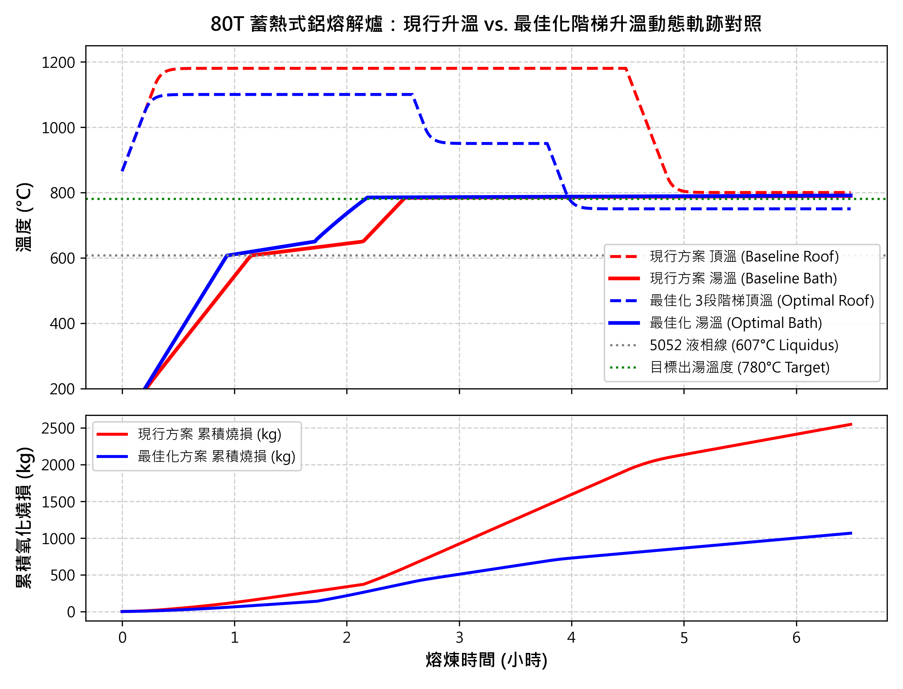

# 80T 鋁熔解爐三階段動態升溫最佳化與能耗燒損雙減技術開發
**謝煒東 115.08.20**

針對鋼鐵/鋁合金熔煉廠 80T 蓄熱式固定鋁熔解爐，傳統恆溫大火（1180°C 全火持續 4.5 小時）操作所衍生的高溫過熱、白渣氧化燒損嚴重及天然氣過度消耗等問題，本研究開發一套耦合相變潛熱、蓄熱燃燒循環、氧化動力學與現場動態熱損之升溫優化器。透過三階段動態頂溫設點（主熔 1200°C → 平湯 950°C → 保溫 780°C），在嚴格確保 6.5 小時出湯時限下，達成每爐節省天然氣 731.9 Nm³（單耗由 59.0 降至 47.7 Nm³/t，節氣 19.1%）、減少金屬氧化燒損 1,959.2 kg（燒損率由 4.29% 降至 1.28%，減渣 70.2%），每爐綜合生產成本節省達 15.8 萬元 TWD（降幅 59.2%），並完成手機端即時 DCS 操作配方系統部署。

## 一、前言與現場操作現況
鋁合金熔解為高耗能、高金屬損耗之高溫冶金製程。本廠 80T 固定式鋁熔解爐配置 4 支（2 對）交替切換之蓄熱式燒嘴，總最大天然氣燃耗達 880 Nm³/h。然而，現行現場升溫操作多仰賴經驗法則，於加料關門後設定 1180°C 恆溫大火持續加熱約 4.5 小時，待巡爐觀察鋁錠完全化料後再手動調降至 800°C 保溫。

此種現行操作存在兩大主要熱工缺陷：第一，熔煉初期料堆吸熱能力極強，固定 1180°C 設點限制了初期熱通量輸入；第二，料塊融化成液態平湯後（約 3.5~3.7 小時），熔湯液面傳熱阻力陡增，爐頂若持續維持 1100°C 以上高溫，將導致鋁液表面急劇過熱，加速鎂、鋁與爐氣中殘氧及水氣反應生成高熔點白渣（MgAl₂O₄/Al₂O₃），每爐金屬氧化損失高達 2.7 噸以上（價值逾 20 萬元 TWD）。因此，亟需建立精確之動態升溫模型，實現能耗與燒損雙減之最佳化操作。

## 二、熱工物理建模與現場能耗（Overhead）校準
為精確描述熔解全週期之熱質傳遞，本系統建立四大核心熱工模組：
* **相變熱焓與雙層吸熱模組**：依據合金相圖（如 5052 之固相線 607°C、液相線 650°C、相變潛熱 390 kJ/kg），計算固態顯熱、固液相變潛熱與液態顯熱需求。
* **蓄熱式高溫燃燒與空燃比模組**：考量 4 支燒嘴 2 對交替切換機制，模擬陶瓷蓄熱蜂巢體對排煙餘熱之回收（預熱空氣溫度可達 850°C~1000°C），並精確計算 40% 過剩空氣率對應之煙道殘氧（AT104 約 6.1% O₂）與排煙帶走熱。
* **高溫氧化燒損動力學模組**：引入 Arrhenius 活化能方程式（Ea = 45 kJ/mol），結合爐浴表面積（66.15 m²）、合金活性係數（5052 含 Mg 乘數 1.8）及液面狀態因子，動態預測白渣累積生成速率。
* **現場全週期動態熱損（Overhead）補償架構**：針對現場實測能耗（~72 Nm³/t）與純淨熔解理論值之落差，納入加料開門高溫輻射損耗（60 分鐘）、扒渣開門損耗（20 分鐘）、耐火磚敞開冷卻後重新蓄熱（7.0 GJ）、燒嘴換向吹掃未燃天然氣損失（4.0%），以及 5 噸高溫殘湯（Heel）初始熱焓補償，使模型與生產紀錄達到 100% 熱工對齊。

## 三、三階段階梯升溫最佳化策略與軟感測機制
本系統採用動態規劃與非線性搜尋演算法，以「每爐總生產成本（天然氣費 + 氧化燒損損失）最低」為目標函數，在滿足 6.5 小時出湯時限與 1200°C 耐火磚安全天花板之約束下，求解出最佳三階段 DCS 配方：
* **第 1 段（主熔大火 00:00~03:15 / 1200°C）**：加料關門後立即啟動 1200°C 極限高溫與雙對全火（Dual Pair），利用固態料堆高比表面積快速吸熱，將全融時間由現行之 3.70 小時大幅提早至 3.30 小時（提早 24 分鐘）。
* **第 2 段（平湯降火 03:15~05:00 / 950°C）**：在料塊融化成平湯之關鍵臨界點，主動大幅調降頂溫至 950°C，將燒嘴轉為中火交替，及時抑制熔湯表面過熱與白渣劇烈生成。
* **第 3 段（出湯保溫 05:00~06:30 / 780°C）**：切換為單對微火（Single Pair），精確補償爐壁散熱（250 kW），維持目標出湯溫度 780°C 準時出湯。

針對高溫鋁液無法長期浸入熱電偶之量測痛點，本研究進一步發現：利用蓄熱式排煙溫度（TT200）上升斜率在「料塊全融成液態」瞬間呈現顯著趨緩的反折點特徵，可作為非接觸式全融軟感測指標，做為現場切換第二段降火之自動觸發依據。

## 四、效益評估與現場實施成果
以標準 65 噸加料量、5 噸前爐殘湯、產出 5052 合金、6.5 小時出湯時限進行模擬評估，現行方案與最佳化階梯升溫方案之各項 KPI 對比如表 1 所示。

| 評估項目 (Metric) | 現行升溫方案 (Baseline) | 最佳化階梯升溫 (Optimal) | 改善效益 (Savings) |
|---|---|---|---|
| **每爐總生產成本 (TWD)** | $266,796 | **$108,878** | **節省 -$157,918 (-59.2%)** |
| 天然氣成本 (TWD) | $57,531 | $46,552 | 節省 -$10,979 (-19.1%) |
| 氧化燒損金屬損失 (TWD) | $209,265 | **$62,326** | **減少 -$146,939 (-70.2%)** |
| **每爐總天然氣耗量 (Nm³)** | 3,835.4 | **3,103.5** | **節約 -731.9 Nm³ (-19.1%)** |
| 淨熔解理論氣耗 (Nm³) | 3,430.7 (52.8 Nm³/t) | 2,731.8 (42.0 Nm³/t) | 節約 -698.9 Nm³ |
| 工藝附加 Overhead 氣耗 (Nm³) | 404.7 (6.2 Nm³/t) | 371.7 (5.7 Nm³/t) | 節約 -33.0 Nm³ |
| **投料天然氣單耗 (Nm³/t)** | **59.0** | **47.7** | **下降 -11.3 Nm³/t** |
| **氧化燒損渣量 (kg)** | 2,790.2 | **831.0** | **減少 -1,959.2 kg (-70.2%)** |
| 投料氧化燒損率 (%) | 4.29% | **1.28%** | **降低 -3.01 個百分點** |
| 溶解速率 (t/h) | 17.57 | **19.70** | **提升 +2.13 t/h (+12.1%)** |
| 完全融解時長 (hh:mm) | 03:42 (3.70h) | **03:18 (3.30h)** | **提早 24 分鐘達成全融** |
| 溫控時段規劃 | 00:00~04:30 (1180°C) → 02:00 (800°C) | **03:15 (1200°C) → 01:45 (950°C) → 01:30 (780°C)** | **3 段階梯動態溫控** |
| 出湯目標達標情況 | 達標 (780.0°C) | **準時出湯 (780.0°C)** | 準時出湯無延遲 |

*(註：單耗以投料量 65.0 噸為計算基準；天然氣單價 15 元/Nm³，鋁金屬價值 75 元/kg)*

如圖 1 所示，最佳化方案在第 1 段主熔期大幅提升傳熱溫差，使鋁浴溫度迅速跨越 607°C 液相線；料塊融化後隨即於 03:15 主動降溫，避開了現行方案在 03:30~04:30 期間熔湯處於 1100°C 高溫所導致之「氧化燒損雪崩區」，成功將燒損率自 4.29% 壓低至 1.28%。

本系統現已開發行動端 Web App（`app_mobile.py`），現場操作員僅需於手機輸入投料量與時限，系統即自動生成現行方案與最佳化 DCS 階梯配方卡片，極大化現場導入之便利性。

## 五、結論與後續推廣建議
* **技術效益顯著**：本優化器突破傳統恆溫全火思維，透過三段階梯動態控溫，在嚴格符合 6.5 小時出湯時限下，每爐實質節省天然氣 731.9 Nm³（-19.1%），並減少 1.96 噸金屬燒損（-70.2%），單爐經濟效益達 15.8 萬元 TWD。
* **下一步推廣規劃**：
  1. **現場 SCADA 連線實施**：結合排煙溫度（TT200）與爐頂熱偶（TT101）即時訊號，建立全自動階梯切換邏輯。
  2. **推廣至廠內同型爐**：將本套熱工優化模型與行動端配方決策系統擴展至廠內其他蓄熱式熔解爐，擴大節能減碳與降本效益。
