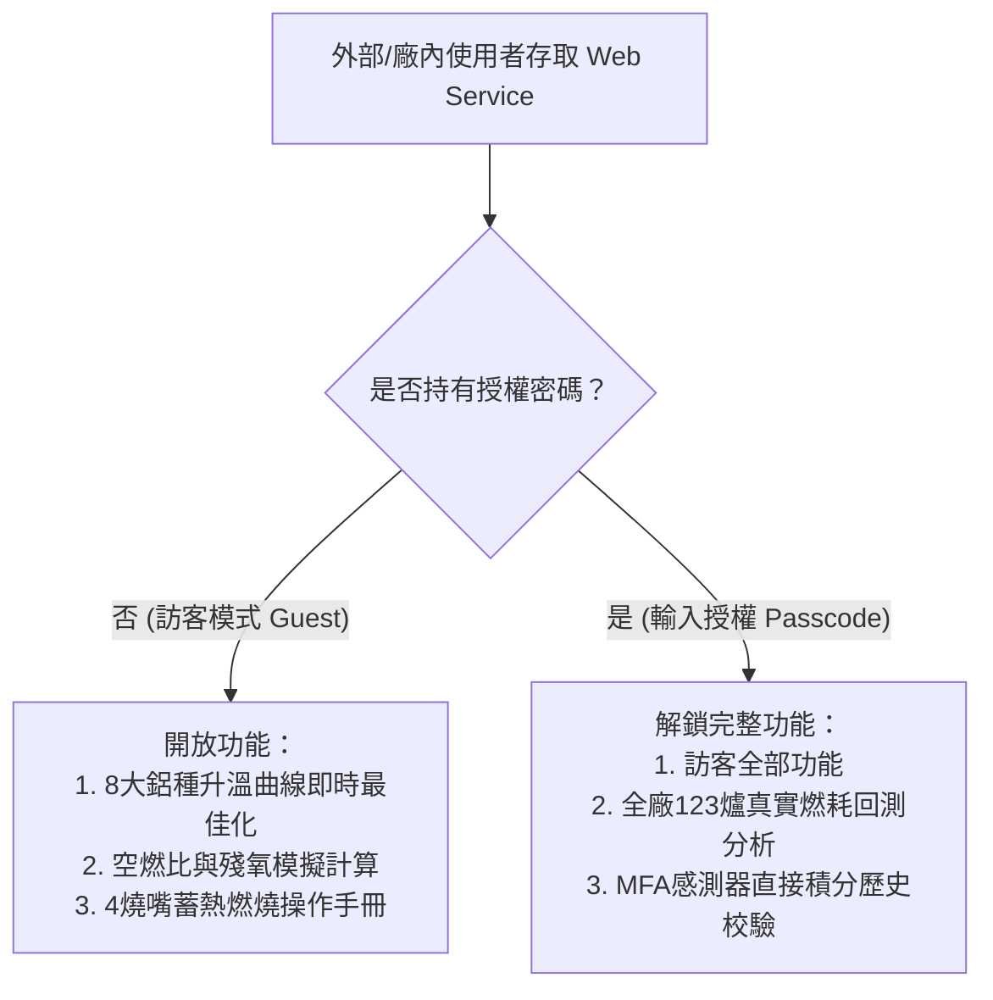

# 80T 熔鋁爐系統 Web 服務權限隔離與存取控制說明

## 概述 (Access Control Overview)
為了讓 `app.py` 能夠安全地作為 Web Service 提供外部或廠內同仁透過瀏覽器存取，同時避免工廠內部敏感資料（114/115年 MFX 生產日報 Excel 與感測器高頻時序數據）遭到未授權查閱，系統已實施**分級權限隔離機制 (Role-Based Access Control)**。



---

## 權限分級說明 (Permission Levels)

### 1. 訪客公開模式 (Public / Guest Mode)
* **適用對象**：未輸入密碼之一般使用者、現場操作員、外部訪客。
* **開放功能**：
  * `🚀 即時單爐最佳化模擬`：可自由調整投料重量、殘湯、時限、合金種類進行即時熱力學相變與空燃比最佳化計算。
  * `📖 4燒嘴蓄熱系統手冊`：查閱 Mechatherm 系統規格、蓄熱反轉機制與空燃比技術手冊。
* **保護隔離**：
  * `📊 歷史爐次回測分析 (🔒 需授權)`：標記鎖定圖示，分頁內遮蔽所有歷史生產日報數據與回測按鈕，提示需輸入授權密碼。

### 2. 授權研究員模式 (Authorized Analyst Mode)
* **適用對象**：專案研發人員、能源管理主管、授權工程師。
* **解鎖方式**：
  * 方式 A：於左側側邊欄「🔒 系統權限與登入」展開輸入密碼。
  * 方式 B：直接切換至「📊 歷史爐次回測分析」分頁，於中央登入卡片輸入密碼並點選「解鎖」。
* **解鎖功能**：
  * 分頁標題自動變更為 `📊 歷史爐次回測分析 (✅ 已解鎖)`。
  * 完整開放 MFA 感測器週數據實測回測與全廠 123 爐次歷史生產日報回測明細表格。
  * 側邊欄提供「🚪 登出權限 (Logout)」按鈕，隨時可一鍵切回訪客模式。

---

## 預設授權密碼與自訂配置 (Configuration)

### 預設授權密碼清單 (Default Passcodes)
* `rd2026` (研發人員專用)
* `melter80t` (熔鋁爐專用)
* `mfx2026` (廠區專用)
* `admin888` (管理員專用)

### 自訂環境變數覆寫 (Environment Variable Override)
若部署至伺服器或雲端環境，可在啟動前設定環境變數 `MELTER_AUTH_PASSWORD`，系統將優先以此密碼作為最高授權金鑰：
```powershell
# Windows PowerShell
$env:MELTER_AUTH_PASSWORD = "YourCustomSecurePassword2026"
streamlit run app.py --server.address 0.0.0.0 --server.port 8501

# Linux / macOS Bash
export MELTER_AUTH_PASSWORD="YourCustomSecurePassword2026"
streamlit run app.py --server.address 0.0.0.0 --server.port 8501
```
