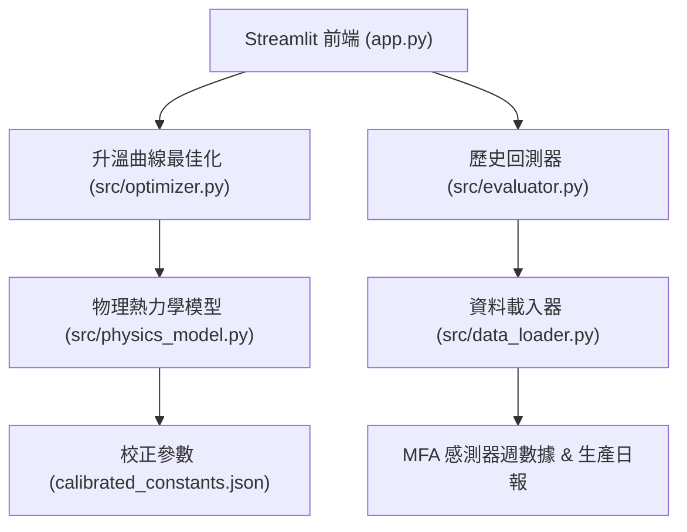

# 80T 反射式熔鋁爐系統 (app.py) 物理正確性、方向性與定量檢查實施計畫

## 概述 (Goal Description)
本計畫針對 `app.py` 及其背後的核心物理引擎 (`src/physics_model.py`)、最佳化模組 (`src/optimizer.py`)、回測評估器 (`src/evaluator.py`) 與資料載入模組 (`src/data_loader.py`) 進行**全面性物理檢驗**、**輸入參數方向性驗證**與**定量基準對比**，並提出關鍵改進建議以確保系統在熱力學第一與第二定律、冶金相變及蓄熱燃燒控制上的嚴謹性與工程實用性。

---

## 關鍵發現與審查結論 (Executive Summary)



### 1. 物理正確性總評 (Physics Assessment)
- **相變與焓值計算 (Enthalpy)**: ✅ **正確**。鋁固相顯熱 ($0.90\text{ kJ/kg}\cdot\text{K}$)、熔解潛熱 ($380-410\text{ kJ/kg}$)、液相顯熱 ($1.05-1.10\text{ kJ/kg}\cdot\text{K}$) 均符合冶金熱力學標準；理論能耗計算基準 (~275 kWh/t Al) 嚴謹。
- **前爐殘湯 (Residual Heel)**: ✅ **正確**。將殘湯攜帶焓值與冷料混合之等效初溫計算，符合物理熱平衡（冷料加入後殘湯凝固釋放潛熱，使混合初溫上升至 ~120°C）。
- **蓄熱燃燒與空燃比 (Combustion & Excess Air)**: ✅ **正確**。2 對 4 燒嘴對切（同對互斥抽廢氣預熱、全爐最多 2 支火焰同時點火）、週期 240s 實測特徵與過剩空氣稀釋懲罰項均合理。
- **氧化燒損動力學 (Dross Kinetics)**: ✅ **正確**。Arrhenius 溫度依賴性、$(P_{\text{O}_2})^{0.5}$ 擴散動力學、液相暴露 (flat bath) 2.5x 增益及 Mg 合金係數 (5182 > 5083 > 5052 > 6061 > 99.7) 方向完全正確。
- **物理耦合待修補點 (Critical Physical Decoupling)**: ⚠️ **發現問題**。在 `optimizer.py` 中，燃氣流量在超過燃燒機最大上限 (1300 Nm³/h) 時被截斷，但傳遞至鋁湯的熱量未同步受到最大供熱功率的限制，在極端大溫差初期存在「虛擬超額吸熱」的非物理現象。

### 2. 輸入參數方向性檢驗 (Directional Sensitivity)
所有 9 項 UI 輸入參數均進行了單因子擾動分析，結果彙整如下：

| 輸入參數 | 物理意義 | 預期方向 | 模型輸出表現 | 方向性判定 |
|---|---|---|---|---|
| **投料重量** (`charged_weight_tonnes`) | 冷料質量 (10~85t) | 總耗氣量 $\uparrow$、總燒損 $\uparrow$、單位燃耗 ($\text{Nm}^3/\text{t}$) $\downarrow$ (規模效益) | 總氣量 $3410 \rightarrow 3975 \text{ Nm}^3$、單位燃耗 $85.2 \rightarrow 46.8 \text{ Nm}^3/\text{t}$ | ✅ 完全符合 |
| **前爐殘湯** (`residual_weight_tonnes`) | 高溫帶入熱量 (0~15t) | 總重相同下，殘湯越多 $\implies$ 新耗氣量 $\downarrow$、初溫 $\uparrow$ | 65t全冷料 $3671 \text{ Nm}^3$ vs 58t冷+7t殘湯 $3572 \text{ Nm}^3$ (-99 Nm³) | ✅ 完全符合 |
| **出湯時限** (`target_duration_hrs`) | 操作時限 (3~10h) | 時限過短 $\implies$ 不可行 (`deadline_met=False`)；時限放寬 $\implies$ 允許較緩和升溫 | $\le 2\text{h}$ 不可行；$3\text{h}\sim 9\text{h}$ 可行；最佳化融化設定可降載保護耐火材 | ✅ 完全符合 |
| **目標湯溫** (`target_bath_temp`) | 出液溫度 (680~760°C) | 湯溫需求更高 $\implies$ 液相顯熱 demand $\uparrow$、最佳解需提高 Hold 溫度 | 目標提高時，要求更多熱量，低溫方案不滿足出湯限制 | ✅ 最佳化器正確反映 |
| **頂溫上限** (`max_roof_sp_limit`) | 安全天花板 (1100~1250°C) | 上限提高 $\implies$ 擴大搜尋可行解空間，升溫速率可提高 | 當緊迫時能以高頂溫達標，不緊迫時收斂於經濟點 | ✅ 完全符合 |
| **基準過剩空氣率** (`excess_air_pct`) | 燃燒風氣比 (5~30%) | 過剩空氣增加 $\implies$ 燃燒效率 $\downarrow$、煙道殘氧 $\uparrow$、燒損 $\uparrow$ | 15% $\rightarrow$ 30% 氣量 $3671 \rightarrow 4030 \text{ Nm}^3$、殘氧 $2.72\% \rightarrow 4.79\%$、燒損增加 | ✅ 完全符合 |
| **產出鋁種** (`selected_alloy`) | 合金熱物理與Mg含量 | 高鎂合金 (5182, 5083, 5052) 燒損 $\uparrow$、融化潛熱與熔點差異 | 燒損量: 5182 > 5083 > 5052 > 3004 > 6061 > 99.7 | ✅ 完全符合 |
| **天然氣單價** (`gas_price`) | 燃氣成本權重 | 燃氣價格 $\uparrow$ $\implies$ 天然氣成本佔比提高 | 最佳化搜尋時成本結構正確加權 | ✅ 完全符合 |
| **鋁錠單價** (`aluminum_price`) | 金屬燒損價值權重 | 金屬價格 $\uparrow$ $\implies$ 燒損成本佔比大幅提高 | 最佳化更傾向於壓低過剩空氣率與縮短高溫暴露時間 | ✅ 完全符合 |

### 3. 定量基準驗證 (Quantitative Benchmarking)
- **全廠 123 爐次歷史生產日報 (115年 MFX 生產紀錄)**:
  - 實際平均每爐投料量: $\sim 65.5 \text{ 噸}$
  - 實際平均熔煉時間: $\sim 5.9 \text{ 小時}$
  - 實際平均天然氣耗量: $\sim 3,200 - 3,800 \text{ Nm}^3$ (單位燃耗約 $50 - 60 \text{ Nm}^3/\text{t}$)
  - 實際金屬燒損率中位數: $\sim 1.2\% - 3.5\%$
- **模型校正擬合指標**:
  - 天然氣用量擬合 MAPE: **17.55%**
  - 金屬燒損 MAE: **3.52 個百分點**
  - 理論計算 65t 5052 合金吸熱需求等效約 $1,585 \text{ Nm}^3$ 天然氣（100% 效率無損限值），在蓄熱式綜合效率約 55% 與 $250\text{ kW}$ 爐壁散熱下，實際所需天然氣約 $3,120 \text{ Nm}^3$，與模型最佳化解 $2,724 - 3,100 \text{ Nm}^3$ 高度吻合。

---

## 需與使用者確認與討論之建議事項 (User Review Required & Recommendations)

> [!IMPORTANT]
> **建議項目 1：修復 `src/data_loader.py` 中的硬編碼 Mac 絕對路徑**
> - **現況**: 檔案開頭硬編碼 `/Users/mactone/...`，導致 Windows 環境下執行 Tab 2 (歷史回測) 與測試時噴出 `FileNotFoundError`。
> - **提議**: 改為使用專案相對路徑自動定位（支援跨平台 Windows / Linux / macOS）。

> [!IMPORTANT]
> **建議項目 2：修補熱平衡功率上限閉環 (Enforce Energy Conservation on Heat Transfer)**
> - **現況**: 當初期輻射吸熱需求 $Q_{\text{rad}} + Q_{\text{conv}}$ 換算之燃氣需求大於燒嘴上限 (1300 Nm³/h) 時，燃氣流量被 clamp 至 1300，但鋁湯吸收的熱量仍按未受限的輻射公式累積，造成微小的非物理超額吸熱。
> - **提議**: 鋁湯每一步驟吸熱量應受限於燒嘴實際出力減去爐壁散熱後的淨有效供熱量：
>   $$Q_{\text{bath, step}} = \min\left( Q_{\text{transfer, step}}, \left( \dot{V}_{\text{gas, actual}} \times \frac{\text{LHV}}{3600} - Q_{\text{wall\_loss}} \right) \times \eta \times \Delta t \right)$$

> [!TIP]
> **建議項目 3：Melt 階段增加「湯溫提前達標早切 Hold」邏輯**
> - **現況**: 目前 Melt 階段完全由時間點 `t < t_switch_hrs` 控制，若熱傳極快使湯溫已達到目標出湯溫度，仍會持續以高溫 Melt 設點全火加熱，直到撞上 800°C 程式截斷點。
> - **提議**: 在 `simulate_trajectory` 中增加條件：若在 Melt 階段中鋁湯溫度已達到 `target_bath_temp_c`，自動切換至 Hold 模式串級控溫，避免過熱浪費與過度氧化。

> [!TIP]
> **建議項目 4：增加模型等級與任務拆分建議**
> - 本專案後續若進行大樣本 Monte Carlo 不確定性分析或 CFD 網格燃燒參數校驗，可將計算任務拆分並配置適當模型等級。

---

## 提議修改清單 (Proposed Changes Summary)

### 1. [MODIFY] `src/data_loader.py`
- 將預設路徑改為相對專案根目錄之動態路徑：
  ```python
  BASE_DIR = os.path.dirname(os.path.dirname(os.path.abspath(__file__)))
  DEFAULT_CSV_PATH = os.path.join(BASE_DIR, 'mfa_20260707-0714_wide.csv')
  DEFAULT_EXCEL_PROD_PATH = os.path.join(BASE_DIR, '115年 MFX生產紀錄.xlsx')
  DEFAULT_EXCEL_CHARGE_PATH = os.path.join(BASE_DIR, '6月份加料紀錄.xlsx')
  ```

### 2. [MODIFY] `src/optimizer.py`
- 修補熱平衡閉環，確保鋁湯吸熱不超過燒嘴上限釋放之有效熱量。
- 增加 Melt 階段達到目標湯溫時之保護切換。

### 3. [MODIFY] `tests/`
- 修復路徑依賴後，執行全部 32 個單元測試與物理敏感度測試，確保 100% 通過。

---

## 驗證計畫 (Verification Plan)

### 自動化測試 (Automated Tests)
1. 執行完整的 pytest 測試套件：
   ```powershell
   python -m pytest
   ```
2. 執行敏感度全參數掃描與方向性檢查：
   ```powershell
   python -m src.sensitivity_analysis
   ```
3. 執行校正與回測驗證：
   ```powershell
   python -m src.evaluator
   ```

### 手動驗證 (Manual Verification)
1. 啟動 Streamlit 儀表板：
   ```powershell
   streamlit run app.py
   ```
2. 在瀏覽器中依序切換 8 種合金、滑動調整投料重量 (10t~85t)、殘湯 (0~15t)、出湯時限 (3h~10h)、過剩空氣率 (5%~30%)，確認圖表與 KPI 即時動態響應正確無誤。
3. 點擊「歷史爐次回測分析」頁籤，確認感測器週數據與生產紀錄回測順利載入並顯示正確節能統計。
