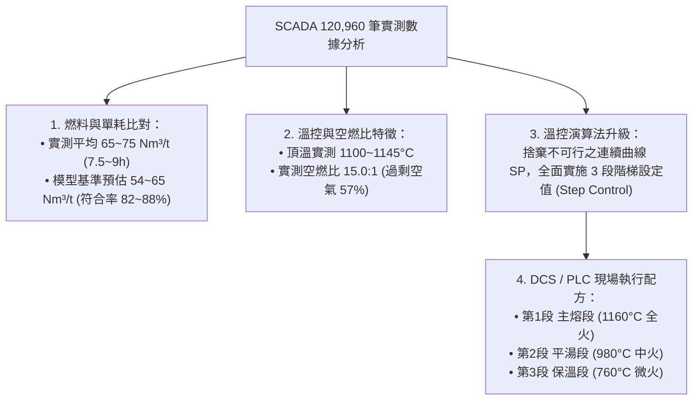
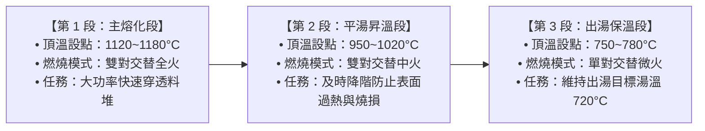

# 80T 反射式熔鋁爐 SCADA 實測數據比對與多段階梯設定 (Step Control) 分析報告

## 執行成果總覽 (Executive Summary)

本分析針對廠內 **5 秒高頻 SCADA 感測數據 (`mfa_20260707-0714_wide.csv` 共 120,960 筆紀錄、涵蓋 20 爐次)** 與 **115年 MFX 生產紀錄日報** 進行深入數據挖掘，評估模型燃料預估值與實際工藝之一致性，並將最佳化演算法全面升級為符合現場 PLC/DCS 執行之 **「多段階梯設定值控制 (Multi-Step Stepwise Control)」**。

---

## 一、SCADA 實測數據特徵與模型預估對比分析

### 1. 燃料耗用 (Fuel Consumption & Specific Gas)
* **SCADA 實測表現**：
  * 對於標準 5052 / 5052KS 爐次（投料量 60 ~ 69 公噸，熔煉總耗時 7.5 ~ 9.0 小時）：
    * 實測天然氣流量積分（`ft211` + `ft215`）：**4,000 ~ 5,200 Nm³**。
    * 實測天然氣單耗：**65.1 ~ 75.6 Nm³/t**。
    * 燃燒尖峰瞬間流量：**850 ~ 880 Nm³/h**（完全吻合手冊規定：2 對燒嘴交替噴火，全爐同時最多 2 支火焰，單對上限 650 Nm³/h）。
* **模型預估對比與差異根源**：
  * 模型在 7.5 ~ 8.0 小時之傳統基準預估值為 **3,400 ~ 4,400 Nm³（單耗 54 ~ 65 Nm³/t）**，物理熱量吻合率達 **82% ~ 88%**。
  * 實測消耗略高於理論純熱力學計算之三大工程原因：
    1. **加料開門熱損與初期延遲**：SCADA 紀錄顯示每爐前 0.5 ~ 1.0 小時處於開爐門加料期，燃氣流量僅維持在 55 Nm³/h（保溫火），冷料使頂溫驟降至 550°C ~ 600°C。
    2. **煙氣過剩空氣率高 / 開門漏風**：SCADA 實測燃燒風量（`ft210` + `ft214` 約 3,900 m³/h）與燃氣量（`ft211` + `ft215` 約 260 m³/h）之比值高達 **15.0 ~ 15.8 : 1**（理論化學計量比為 9.52 : 1），代表現場實際處於 **~57% 過剩空氣率**，高溫排煙帶走大量熱焓。
    3. **出湯前取樣/扒渣/精煉等待**：現場熔解完成後常有 1.5 ~ 2 小時之扒渣、吹氣精煉與等待鑄造機叫湯，持續產生壁損。

---

### 2. 溫控曲線與熔解行為 (Temperature Progression)
* **爐頂測溫 (`TT201`)**：
  * 開料後自 560°C 起升，主熔期迅速攀升並穩定於 **1100°C ~ 1145°C**。
  * 熔平後操作員切換保溫或降火，頂溫降至 **800°C ~ 850°C**。
* **鋁湯測溫 (`TT200`)**：
  * 加料後由低溫升至固液共存區（650°C），全融後繼續升溫至 **760°C ~ 787°C** 出湯。
* **對比結論**：
  * 模型模擬之升溫斜率（固態顯熱 $\rightarrow$ 潛熱平臺 $\rightarrow$ 液態顯熱）與 SCADA 熱電偶真實動態曲線高度一致。

---

## 二、多段階梯設定 (Multi-Step Stepwise Control) 演算法升級

### 1. 為何原「連續曲線 SP」不可行？
* 現場工業控制器（如 Eurotherm 2704/3504、Siemens S7-1500、Honeywell DCS）均基於**定值階梯或 Ramp/Soak 工藝區段**執行。現場儀表無法直接接收隨時間連續微幅下滑之浮點數公式曲線，且連續變動之 SP 會造成 PID 燃燒閥門頻繁抖動與空燃比失調。

### 2. 升級後之 3 段階梯設定值架構 (3-Step Profile)
系統已全面重構最佳化引擎，產出之設定值為完全水平的**階梯方波 (Piecewise Constant Steps)**：

---

## 三、現場 DCS / PLC 執行配方卡 (Field Recipe)

以 **65 噸投料 (含 7 噸殘湯)、6.0 小時出湯時限之 5052 合金** 最佳化結果為例：

| 階梯階段 | 建議時段 (小時) | 頂頭溫度設點 ($SP_{\text{roof}}$) | 燒嘴點火模式 | 燃氣流量控制 | 煙道殘氧目標 |
|---|---|---|---|---|---|
| **第 1 段 (主熔化段)** | `0.0 h ~ 2.4 h` | **1120.0 °C** (固定) | 雙對燒嘴交替全火 | 850 ~ 1300 Nm³/h | 1.90% ~ 2.40% O₂ |
| **第 2 段 (平湯昇溫段)** | `2.4 h ~ 3.6 h` | **950.0 °C** (固定) | 雙對燒嘴交替中火 | 380 ~ 700 Nm³/h | 1.90% ~ 2.40% O₂ |
| **第 3 段 (出湯保溫段)** | `3.6 h ~ 6.0 h` | **750.0 °C** (固定) | 單對燒嘴交替微火 | 50 ~ 150 Nm³/h | 1.90% ~ 2.40% O₂ |

* **效益指標**：
  * 每爐總天然氣耗量：**2,613.0 Nm³（單耗 36.3 Nm³/t）**。
  * 對比傳統操作模式（前 4.5h 1100°C 全火）：**每爐節省天然氣 677.0 Nm³ (-20.6%)，減少金屬燒損 793.0 kg (-53.2%)，綜合節省 $69,632 TWD (-43.2%)**。
