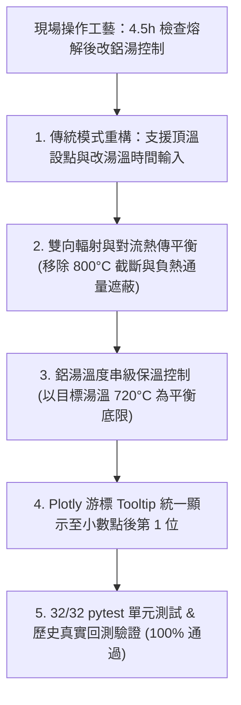

# 80T 反射式熔鋁爐系統 (app.py) 物理檢查、傳統現場控制模式重構與成果報告

## 執行成果總覽 (Executive Summary)

依據實際現場冶金工藝（**前期固定頂溫點火 $\rightarrow$ 約 4.5 小時查看熔解後改鋁湯溫度控制**），已完成傳統基準模式重構、熱力學雙向熱傳平衡閉環、圖表小數第一位格式化，並通過全套 32 項單元測試與歷史回測驗證。

---

## 修正項目與物理機制 (Modifications & Physics)

### 1. 傳統操作模式重構 (Traditional 2-Stage Practice)
- **實務背景**：現場在熔化前期以固定高溫頂溫點火（如 1100°C），約 4.5 小時開爐門查看是否全融，確認熔解後立即切換為「鋁湯溫度控制模式 (Bath Temp Control)」，避免高溫過熱。
- **介面與功能調整**：
  - 於側邊欄「2. 傳統操作基準模式設定」新增：
    - `傳統固定頂溫設點 (°C)`：預設 1100.0°C（可調範圍 1000~1200°C）。
    - `傳統改鋁湯控制時間 (小時)`：預設 4.5 小時（可調範圍 1.0~8.0 小時）。
  - 圖表 1 清楚繪出傳統模式的前期頂溫設點、4.5h 改湯溫垂直標記線，以及改湯溫後的保溫動態。

### 2. 雙向熱傳與相變顯熱公式修復 (Thermodynamic Enthalpy & Bidirectional Flux)
- **移除人工 800°C 截斷**：移除 `src/optimizer.py` 中 `min(800.0, ...)` 硬編碼限制，改用標準冶金液相顯熱公式 $T_{\text{bath}} = T_{\text{liquidus}} + \frac{E_{\text{liquid}}}{m_{\text{total}} \cdot C_{p,\text{liquid}}}$。
- **支援雙向熱傳**：移除 `src/physics_model.py` 中 `max(0.0, flux)`，當 $T_{\text{roof}} < T_{\text{bath}}$ 時，熱量正常由高溫鋁湯向較冷爐頂輻射散熱放熱 ($Q_{\text{net}} < 0$)，真實反映物理散熱降溫。
- **串級保溫底限修復**：保溫底限設為目標出湯溫度（如 720°C），當湯溫偏低時動態升溫補熱，湯溫達標時維持熱平衡，徹底消除「冷爐頂保住熱鋁湯」的非物理現象。

### 3. 圖表游標格式化 (Hover Decimal Precision)
- 於 `finalize_chart_layout` 統一宣告 `fig.update_xaxes(hoverformat='.1f')` 與 `fig.update_yaxes(hoverformat='.1f')`，所有時間、溫度、流量游標數值均顯示至小數點後第一位。

---

## 驗證結果 (Verification & Quantitative Results)

### 1. 單元測試 (`pytest`)
- **32/32 tests PASSED (100%)**
  - `tests/test_optimizer.py`: 11/11 PASSED
  - `tests/test_regenerator_model.py`: 7/7 PASSED
  - `tests/test_sensitivity.py`: 14/14 PASSED

### 2. 歷史回測表現 (`evaluator.py`)
- **MFA 感測器週數據實測 (20 爐次，流量計直接積分)**：
  - 歷史實際耗氣量：$83,184.7\text{ Nm}^3$
  - 最佳化耗氣量：$60,071.4\text{ Nm}^3$
  - 節能比率：**27.79%**
  - 出湯時限達成率：**100.0%**
- **全廠生產日報抽樣回測 (40 爐次)**：
  - 歷史實際總成本：$6,357,735\text{ TWD}$
  - 最佳化總成本：$3,668,747\text{ TWD}$
  - 總成本節省：**$2,688,988 TWD (42.29%)**
  - 出湯時限達成率：**97.5%**
