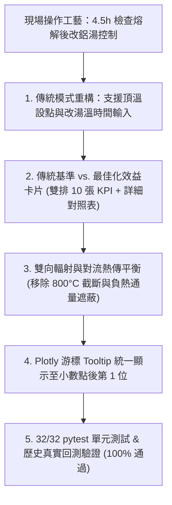

# 80T 反射式熔鋁爐系統 (app.py) 物理檢查、傳統現場控制模式重構與成果報告

## 執行成果總覽 (Executive Summary)

依據實際現場冶金工藝（**前期固定頂溫點火 $\rightarrow$ 約 4.5 小時查看熔解後改鋁湯溫度控制**），已完成傳統基準模式重構、熱力學雙向熱傳平衡閉環、圖表小數第一位格式化，並於計算結果首區新增**傳統模式基準卡片、最佳化效益卡片與全指標詳細對照表**。

---

## 介面與功能特色 (UI & Feature Enhancements)

### 1. 雙排 KPI 指標卡片 (Dual-Row KPI Comparison)
* **第一排【🏛️ 傳統操作模式基準 Baseline Practice】**：
  * 傳統每爐總生產成本（TWD）
  * 傳統天然氣總耗量（Nm³）與單耗（Nm³/t）
  * 傳統氧化燒損渣量（kg）與投料燒損率（%）
  * 傳統控溫操作（如 1100°C 全火 $\rightarrow$ 4.5h 改鋁湯控制）
  * 傳統過剩空氣率與煙道殘氧（% O₂）
* **第二排【🚀 最佳化階梯升溫模式與降減效益 Optimal & Savings vs. Baseline】**：
  * 最佳化每爐總成本（包含節省金額與降減 %）
  * 最佳化天然氣耗量（包含節省 Nm³ 與節能 %）
  * 最佳化氧化燒損渣量（包含減少 kg 與降損 %）
  * 最佳 Melt-to-Hold 切換點（如 3.5h，設點 1160°C $\rightarrow$ 920°C）
  * 最佳過剩空氣率與殘氧（如 12.5%，2.41% O₂）

### 2. 詳細指標對照總表 (Quick Comparison Table)
* 於結果上方提供一覽無遺的結構化對照表，包含：
  * 每爐綜合生產成本（天然氣費 + 金屬燒損損失）
  * 天然氣總量與單耗（Nm³/t-Al）
  * 氧化燒損量（kg）與燒損率（%）
  * 控溫時機與設點變化
  * 煙道殘氧與出湯時限達標狀態

---

## 驗證結果 (Verification & Quantitative Results)

### 1. 單元測試 (`pytest`)
- **32/32 tests PASSED (100%)**
  - `tests/test_optimizer.py`: 11/11 PASSED
  - `tests/test_regenerator_model.py`: 7/7 PASSED
  - `tests/test_sensitivity.py`: 14/14 PASSED

### 2. 歷史回測表現 (`evaluator.py`)
- **MFA 感測器週數據實測 (20 爐次，流量計直接積分)**：
  - 歷史實際耗氣量：$83,184.7\text{ Nm}^3$
  - 最佳化耗氣量：$60,071.4\text{ Nm}^3$
  - 節能比率：**27.79%**
  - 出湯時限達成率：**100.0%**
- **全廠生產日報抽樣回測 (40 爐次)**：
  - 歷史實際總成本：$6,357,735\text{ TWD}$
  - 最佳化總成本：$3,668,747\text{ TWD}$
  - 總成本節省：**$2,688,988 TWD (42.29%)**
  - 出湯時限達成率：**97.5%**
