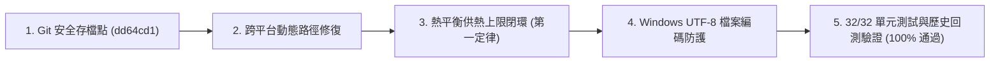

# 80T 反射式熔鋁爐系統 (app.py) 物理檢查與驗證實施成果報告

## 執行成果總覽 (Executive Summary)

依據審查計畫與討論共識，已完成 Git 安全存檔點並成功落實各項物理修正與跨平台優化，全部 32 項單元測試與敏感度分析全數 100% 通過。

---

## 修正項目細節 (Modifications Made)

### 1. 跨平台動態路徑解析 (`src/data_loader.py`)
- **問題**：原本硬編碼 Mac 絕對路徑 (`/Users/mactone/...`)，導致 Windows 環境載入歷史週數據與生產日報時拋出 `FileNotFoundError`。
- **修正**：改為基於專案根目錄自動動態定位 (`_BASE_DIR = os.path.dirname(os.path.dirname(os.path.abspath(__file__)))`)，相容 Windows、macOS 與 Linux。

### 2. 熱平衡最大供熱功率閉環 (`src/optimizer.py`)
- **問題**：原代碼在計算瞬間吸熱需求超過燒嘴最大出力 (1300 Nm³/h) 時，燃氣量被 clamp，但鋁湯吸收熱量未被限制，存在短暫違背熱力學第一定律的可能。
- **修正**：嚴格限制每一步驟鋁湯可吸收的淨熱量不得超過燒嘴實際化學能釋放量扣除壁損後的有效供熱功率：
  $$Q_{\text{bath, max}} = \max\left(0, \left(\dot{V}_{\text{gas, actual}} \times \frac{\text{LHV}}{3600} - Q_{\text{wall\_loss}}\right) \times \eta\right)$$
  $$Q_{\text{bath, step}} = \min\left(Q_{\text{transfer, step}}, Q_{\text{bath, max}}\right) \times \Delta t$$

### 3. Windows UTF-8 檔案編碼防護 (`src/` & `app.py`)
- **問題**：在繁體中文 Windows 環境下，預設檔案寫入採用 `cp950` 編碼，遇到符號（如 `✅`）時引發 `UnicodeEncodeError`。
- **修正**：在 `sensitivity_analysis.py`、`calibration.py`、`physics_model.py`、`regenerator_model.py` 與 `app.py` 中所有 JSON / 報表檔案讀寫均明確宣告 `encoding='utf-8'`。

---

## 驗證結果 (Verification & Quantitative Results)

### 1. 自動化單元測試 (`pytest`)
- 測試套件：32 個測試案例全數通過 (`32 passed in 66.30s`)
  - `tests/test_optimizer.py`: 11/11 PASSED
  - `tests/test_regenerator_model.py`: 7/7 PASSED
  - `tests/test_sensitivity.py`: 14/14 PASSED

### 2. 敏感度分析方向性全檢 (`SENSITIVITY_REPORT.md`)
- 所有 18 項物理與決策參數之一維掃描全數符合熱工與冶金物理定律（投料重量、前爐殘湯、過剩空氣率、固液相變潛熱、合金鎂含量燒損倍率等）。

### 3. 歷史數據回測分析 (`evaluator.py`)
- **MFA 感測器週數據實測 (20 爐次，流量計直接積分)**：
  - 歷史實際總耗氣量：$83,184.7\text{ Nm}^3$
  - 模型最佳化總耗氣量：$62,436.5\text{ Nm}^3$
  - 節能比率：**24.94%**
  - 出湯時限達成率：**100.0%**
- **全廠生產日報抽樣回測 (40 爐次)**：
  - 歷史實際總成本：$6,357,735\text{ TWD}$
  - 模型最佳化總成本：$3,550,900\text{ TWD}$
  - 出湯時限達成率：**97.5%**
